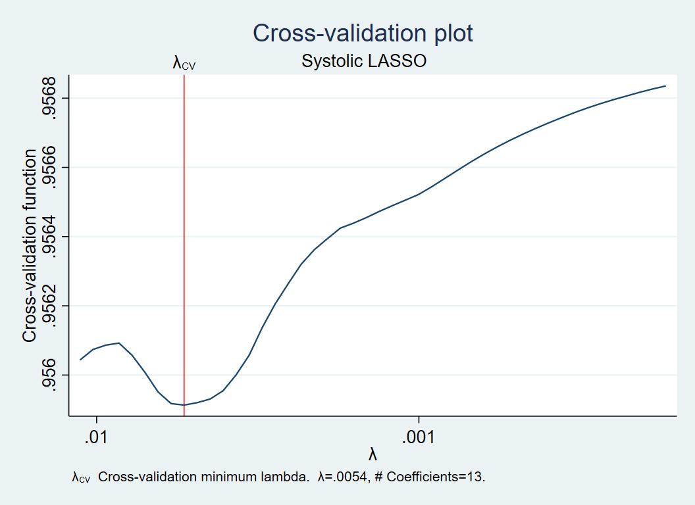

# **Blood Pressure by Gender using LASSO**

# **Introduction**

With the advent of mass-produced antibiotics and the success of nation-wide inoculation campaigns, infectious diseases that were once serious threats to Americans’ health no longer dominate the leading causes of death. Instead chronic diseases; such as heart disease, cancer, and diabetes; have taken their place. Research is ongoing to pinpoint causes for these diseases, but so far the most widely-accepted explanation is lifestyle choices. Data-backed government websites and rumor-based fitness bloggers agree that what we eat and how we move greatly affects the chances of developing chronic diseases.

Yet, past research is heavily skewed towards studying the male body. Maya Dusenbery discusses in her book _Doing Harm_ how women are often disadvantaged by data that is mainly collected from men. She argues that many of the conclusions about common symptoms and reactions did not posit the possibility of important difference among genders and sexes, and assumed that the male-dominated model could represent all. While researchers are updating standards to provide more inclusive advice, we still implicitly accept that assumption in most medical situations.

The combination of rising chronic diseases and lack of diverse gender representation in research provides a unique perspective on the NHANES data. We chose to investigate the effect of consumption habits on blood pressure, a known symptom of different chronic diseases, without the assumption that all genders would react the same. Will the factors that are most important in determining blood pressure be different between males the females? We will show in the following analysis that there are certain foods that affect one gender more than the other, and that these foods change depending on the type of blood pressure being measured. (The study only provided answers of ‘male’ and ‘female’ as identifiable genders, so those will be the only ones in this analysis. Also sex and gender will be used interchangeably in this context.)

>Which predictor variables for blood pressure differ the greatest between males and females?


# **Data**

We’re using a combination of 4 datasets from the 2015-2016 NHANES.

## Datasets {.tabset .tabset-pills}

### Demographics

The demographics dataset (DEMO_I.XPT) provides us with the **gender markers** for each respondent.

### Blood Pressure

The blood pressure dataset (BPX_I.XPT) gives 4 different readings of systolic and diastolic blood pressure, and we took an average of the first three for each type of blood pressure for each respondent since the 4th is mainly missing.

We are going to have **response variables ‘systolic’**, which will give us generally higher or lower blood pressure, and **‘difference’** (calculated as systolic – diastolic) which will give us situations when only systolic blood pressure increases.

### Total Nutrients

The nutrient datasets (DR1TOT_I.XPT and DR2TOT_I.XPT) provides the **predictor variables**.

We chose the named offenders **alcohol** and **salt**; the macronutrients **total fat, sugar, and protein**; as well as **iron** to represent a meat heavy diet and **dietary fiber** to represent a vegetable heavy diet. We also included **caffeine**, which is highly contested as influencing blood pressure, and **water** as a neutral beverage.

# **Methods**

In order to find the variables that have the greatest effect(s) on blood pressure, we will use LASSO, choosing $\lambda$ by CV.

## LASSO
LASSO, least absolute shrinkage and selector operator, works by finding the coefficients that minimize the OLS equation with a penalty term:

$$
\min _{\beta \in \mathbb{R}^{p}}\left\{\frac{1}{N}\|y-X \beta\|_{2}^{2}+\lambda\|\beta\|_{1}\right\}
$$
As a type of least squares regression with L1 penalty, this LASSO equation **shrinks** all coefficients like in ridge regression but also sets coefficients below a constant to zero, effectively **selecting** variables that have more extreme coefficients.

Due to this shrinking and selecting method, standardizing all predictor variables before inputting them into the LASSO model is crucial, since these terms would be unfairly shrunk if left as is. The most common method for this is to subtract each value by the mean and divide by the standard deviation, which we utilized in our analyses.

The $\lambda$ in the penalty term effectively determines how extreme the model will shrink the coefficients, so finding the right $\lambda$ is important. Usually the $\lambda$ chosen is the one that minimizes the MSE from cross-validation.

## Interaction with Gender

Instead of using gender as a factor or binary variable, we will be converting gender into a continuous numerical variable by setting **‘male’ to 0.5** and **‘female’ to -0.5**. This way, the interaction coefficients can be interpreted as that variable being more important for men or women in determining blood pressure.

We’re only interested in the **interaction between the predictor variables and gender**, so we will be putting penalties only on the interaction terms (penalty = 1) and not on the independent terms (penalty = 0). By creating a penalty weight matrix that 0's and 1's that correspond to the inputted predictor variables, we penalize only the interaction terms, leaving all the independent terms in the model. The remaining interaction coefficients,then, will be the variables that may unequally affect the blood pressure depending on gender.

## Languages/Tools

This analysis will be done using three different techniques:

1.	R with data.table to prepare the data, and lasr to use LASSO

2.	R with dplyr to prepare, the data and glmnet to use LASSO

3.	Stata with the base code to both prepare the data and use LASSO

# **Analysis** {.tabset .tabset-pills}

## R using data.table and glmnet
### _Preparing the Data_

```{r dt, message=FALSE, warning=FALSE, include=FALSE, paged.print=FALSE}
# Libraries: ------------------------------------------------------------------
library(Hmisc)
library(tidyverse)
library(data.table)
library(glmnet)
library(SASxport)
library(kableExtra)

# read in the  data: -----------------------------------------------------------
## This data will be used in the question.
url_base <- 'https://wwwn.cdc.gov/Nchs/Nhanes/2015-2016/'

demo_file <- '../DATA/DEMO_I.XPT'
if ( !file.exists(demo_file) ) {
  demo_url <- sprintf('%s/DEMO_I.XPT', url_base)
  demo <- sasxport.get(demo_url)
  write.xport(demo, file = demo_file)
} else {
  demo <- sasxport.get(demo_file)
}

dr1_file <- '../DATA/DR1TOT_I.XPT'
if ( !file.exists(dr1_file) ) {
  dr1_url <- sprintf('%s/DR1TOT_I.XPT', url_base)
  dr1 <- sasxport.get(dr1_url)
  write.xport(dr1, file = dr1_file)
} else {
  dr1 <- sasxport.get(dr1_file)
}

dr2_file <- '../DATA/DR2TOT_I.XPT'
if ( !file.exists(demo_file) ) {
  dr2_url <- sprintf('%s/DR2TOT_I.XPT', url_base)
  dr2 <- sasxport.get(dr2_url)
  write.xport(dr2, file = dr2_file)
} else {
  dr2 <- sasxport.get(dr2_file)
}

bpx_file <- '../DATA/BPX_I.XPT'
if ( !file.exists(bpx_file) ) {
  bpx_url <- sprintf('%s/BPX_I.XPT', url_base)
  bpx <- sasxport.get(bpx_url)
  write.xport(bpx, file = bpx_file)
} else {
  bpx <- sasxport.get(bpx_file)
}

dr1 <-as.data.table(dr1)
dr2 <-as.data.table(dr2)
demo <-as.data.table(demo)
bpx <-as.data.table(bpx)

```

First, we imported all the 2015-2016 NHANES datasets into R as data.tables. Then we chose our variables of interested and combined the four data.tables into one. All observations with any missing data were dropped. Below is the code for the data cleaning process.

```{r prepare, include=TRUE}
# Choose variables
dr1 = dr1[,.(seqn, dr1talco,dr1.320z,dr1tcaff,dr1tsodi,
             dr1ttfat,dr1tsugr,dr1tiron,dr1tfibe,dr1tprot)]
dr2 = dr2[,.(seqn, dr2talco,dr2.320z,dr2tcaff,dr2tsodi,
             dr2ttfat,dr2tsugr,dr2tiron,dr2tfibe,dr2tprot)]
demo = demo[,.(seqn = seqn, age = ridageyr, pir = indfmpir, gender = riagendr)]
bpx = bpx[,.(seqn = seqn,
             # most people havn't test 4 so we just ignore it
             systolic = (bpxsy1+bpxsy2+bpxsy3)/3,
             diastolic = (bpxdi1+bpxdi2+bpxdi3)/3)][,
             diff:=systolic-diastolic
             ]

# Combine the four data tables and drop the missing values
mydata=dr1[dr2,on = 'seqn'][demo, , on = 'seqn'][bpx,,on = 'seqn'][,
          .(id = seqn, systolic, diastolic, diff, gender,
            alco = (dr1talco+dr2talco)/2, water = (dr1.320z+dr2.320z)/2,
            caff = (dr1tcaff+dr2tcaff)/2, sodi = (dr1tsodi+dr2tsodi)/2,
            fat = (dr1ttfat+dr2ttfat)/2, sugr = (dr1tsugr+dr2tsugr)/2,
            iron = (dr1tiron+dr2tiron)/2, fibe = (dr1tfibe+dr2tfibe)/2,
            prot = (dr1tprot+dr2tprot)/2)][! is.na(id) & ! is.na(systolic) &
            ! is.na(diastolic) & ! is.na(gender) & ! is.na(alco) &
            ! is.na(water) & ! is.na(caff) & ! is.na(sodi) &
            ! is.na(fat) & ! is.na(sugr) & ! is.na(iron) &
            ! is.na(fibe) & ! is.na(prot), ]
```

### _LASSO Using GLMNET_
At first, we planned to use the lars package for LASSO, but we can not add penalty weights in lars. Thus, we chose to use the glmnet package instead. The functions "cv.glmnet", "plot.cv.glmnet" and "glmnet" were utilized.

#### *Response and Predictor Variables*
The response variables are systolic blood pressure and the difference in blood pressures, which combined can more accurately reflect one's blood pressure. The predictor variables, though, need to be standardized before they could be put into the model. Here is the code to standardize the predictor variables:
```{r normalize, echo = TRUE, results = "hide"}
# Normalize the nutrition predictors
mydata[,6:14] <- lapply(mydata[,6:14], function(x) c(scale(x)))

# Change gender 1/2 to -0.5/0.5
mydata = mydata[, gender := ifelse(gender==1, 0.5, -0.5)]
```

Gender was turned from 1 for 'male' and 2 for 'female' into 0.5 for 'male' and -0.5 for 'female', which makes interpretation of the coefficients of the interaction terms more meaningful.

#### *Interaction Terms*

Before doing the LASSO modeling, we added the interaction terms between gender and the nutrition predictors.
```{r interaction, echo = TRUE, results = "hide"}
mydata = mydata[, .(systolic, diff, gender,alco,water,caff,sodi,fat,sugr,iron,fibe,prot,
                    gender_alco = gender*alco,
                    gender_water = gender*water,
                    gender_caff = gender*caff,
                    gender_sodi = gender*sodi,
                    gender_fat = gender*fat,
                    gender_sugr = gender*sugr,
                    gender_iron = gender*iron,
                    gender_fibe = gender*fibe,
                    gender_prot = gender*prot)]
```


#### *Penalty Weights*
Because we're only interested in the remaining interaction terms, we only want to set L1-norm penalties on the coefficients of the interaction terms. Thus, we set penalty weight = 1 for the interaction terms (ex. gender_alco) while not penalizing  the independent terms (ex. alco and gender) by setting penalty weight = 0. We would have a penalty factor of:

````{r penalize factor, echo = TRUE, results = "hide"}
# Only penalize the interaction terms
pnfc=c(rep(0,10),rep(1,9))
```

In our data.table, the first two columns are the response variables; the 3rd to 10th columns are independent predictors and 11th to 21st columns are the interaction terms.

#### *Cross Validation*

Using "cv.glmnet" to choose the lambda with minimum MSE. In general, little inflation of lambda did not cause dramatic differences in LASSO results.

```{r glmnet, echo = TRUE, results = "hide"}
# LASSO using glmnet package: alpha = 1 ---------------------------------------
mydata = as.matrix(mydata)

set.seed(000)
cv_syst = cv.glmnet(x=mydata[,3:21],y=mydata[,1], type.measure="mse", 
                    family="gaussian",penalty.factor=pnfc,alpha = 1)
lambda_syst = cv_syst$lambda.min

cv_diff = cv.glmnet(x=mydata[,3:21],y=mydata[,2], type.measure="mse",
                    family="gaussian", penalty.factor=pnfc,alpha = 1)
lambda_diff = cv_diff$lambda.min
```

However, there is one thing we have to pay attention to. From the plots, it is obvious that the curve id not convex, so if we get the lambda of the edge condition (in the first plot, it is the point around 0.2, which may also be chosen as the lambda with minimum MSE), the penalized coefficients will all be shrinked to 0, which is definitely not what we want. Thus, we avoid that by setting seed and choosing proper cross validation result.

Here is the CV plot to choose lambda for the systolic model:

```{r, echo = FALSE, out.width = '50%', fig.align='center'}
plot(cv_syst$lambda, cv_syst$cvm, ylab = "Mean standard error", xlab = "lambda",
     main = "Cross-validation for lambda in systolic pressure")
abline(v = cv_syst$lambda.min)
```

And here is the CV plot to choose lambda for the difference model:

```{r, echo = FALSE, out.width = '50%', fig.align='center'}
plot(cv_diff$lambda, cv_diff$cvm, ylab = "Mean standard error", xlab = "lambda",
     main = "Cross-validation for lambda in pressure difference")
abline(v = cv_diff$lambda.min)
```

Notes: Here Wenjing used "cv.glmnet" to realize the cross validation. She will update this using self-made cross validation function in the final version.

#### *Modeling*

After the preparation work is complete, we applied the chosen lambda and penalty factor to the glmnet function, only penalizing the interaction terms.

```{r model}
lars_syst = 
  glmnet(x=mydata[,3:21],y=mydata[,1], penalty.factor=pnfc, family="gaussian",
         lambda=lambda_syst, alpha = 1,nlambda=100)

lars_diff = 
  glmnet(x=mydata[,3:21],y=mydata[,2], penalty.factor=pnfc, family="gaussian",
         lambda=lambda_diff, alpha = 1,nlambda=100)
```

### _Results_
We are only focused on the coefficients of the interaction terms. Here are the resulting coefficients from the two models. 

```{r collection, echo = FALSE}
# data collection
coef1 = coef(lars_syst)
coef2 = coef(lars_diff)
coef = cbind(coef1, coef2)
lambda = cbind(lambda_syst, lambda_diff)
rownames(lambda) = "lambda_min_mse"
coef = rbind(coef, lambda)
colnames(coef) = c("systolic", "difference")
coef_int = as.matrix(coef)[c(2,12:21),]
knitr::kable(coef_int, digits=3, caption = "Nutrition Influence on Blood Pressure Across Gender")%>%
  kable_styling(full_width = F)
```


Remember that gender = 0.5 representing male and -0.5 representing female. From previous research, we know that hypertension is more common in men than in women, which is also supported by our results: coefficients of gender in both model are negative.

In the first model, with systolic blood pressure as the response, the variables with the greatest difference between men and women are sodium, alcohol, and caffeine. We can see that men's systolic blood pressure is more effected by alcohol and sodium, while women's blood pressure is more effected by caffeine. In the second model, with difference between systolic and diastolic blood pressure as the response, the variables with the greatest difference between men and women are sodium, alcohol, fat, water, and caffeine. We can see that men's difference in blood pressure is more effected by sodium, alcohol and fat, while women's difference in blood pressure is more effected by caffeine and water.

To make a robust conclusion, we have considered both models together. Men's blood pressure in general is more effected by sodium and alcohol, while women's blood pressure is more effected by caffeine.


## R using dplyr and glmnet

### _Preparing Data_

We begin by importing all the 2015-2016 NHANES datasets. First, we must check if the data is already on file. If not, we will download the data from the website. Here is a sample importing process:

```{r echo=TRUE, message=FALSE, warning=FALSE, paged.print=FALSE}
library(tidyverse)
library(Hmisc)
library(SASxport)
```


```{r message=FALSE, warning=FALSE, paged.print=FALSE}
# read in the  data: -----------------------------------------------------------
## This data will be used in the question.
url_base <- 'https://wwwn.cdc.gov/Nchs/Nhanes/2015-2016/'

demo_file <- '../DATA/DEMO_I.XPT'
if ( !file.exists(demo_file) ) {
  demo_url <- sprintf('%s/DEMO_I.XPT', url_base)
  demo <- sasxport.get(demo_url)
  write.xport(demo, file = demo_file)
} else {
  demo <- sasxport.get(demo_file)
}

```

```{r message=FALSE, warning=FALSE, include=FALSE, paged.print=FALSE}
dr1_file <- '../DATA/DR1TOT_I.XPT'
if ( !file.exists(dr1_file) ) {
  dr1_url <- sprintf('%s/DR1TOT_I.XPT', url_base)
  dr1 <- sasxport.get(dr1_url)
  write.xport(dr1, file = dr1_file)
} else {
  dr1 <- sasxport.get(dr1_file)
}

dr2_file <- '../DATA/DR2TOT_I.XPT'
if ( !file.exists(demo_file) ) {
  dr2_url <- sprintf('%s/DR2TOT_I.XPT', url_base)
  dr2 <- sasxport.get(dr2_url)
  write.xport(dr2, file = dr2_file)
} else {
  dr2 <- sasxport.get(dr2_file)
}

bpx_file <- '../DATA/BPX_I.XPT'
if ( !file.exists(bpx_file) ) {
  bpx_url <- sprintf('%s/BPX_I.XPT', url_base)
  bpx <- sasxport.get(bpx_url)
  write.xport(bpx, file = bpx_file)
} else {
  bpx <- sasxport.get(bpx_file)
}
```


Then we select only the respondents with two full days of data collected with no missing values and take average of each variable as the average nutrition intake.

We also standarized the predictors and merged the data together. Since there are now two days of blood pressure data per respondent, we averaged the systolic and diastolic blood pressures of each respondent as the response variables.

The gender variable was converted from a factor variable into a continuous variable by assigning to 0.5 to male and -0.5 to female, assuring that the expectation of this variable will be zero.

```{r}
# transform all the input values to numeric
dr1 = dr1 %>%
  transmute(seqn = seqn, alco = as.numeric(dr1talco),
            water = as.numeric(dr1.320z), caff = as.numeric(dr1tcaff),
            sodi = as.numeric(dr1tsodi), fat = as.numeric(dr1ttfat),
            sugr = as.numeric(dr1tsugr), iron = as.numeric(dr1tiron),
            fibe = as.numeric(dr1tfibe), prot = as.numeric(dr1tprot) ) %>%
  gather(key = "meas", value = "day1", -seqn )

dr2 = dr2 %>%
  transmute(seqn = seqn, alco = as.numeric(dr2talco),
            water = as.numeric(dr2.320z), caff = as.numeric(dr2tcaff),
            sodi = as.numeric(dr2tsodi), fat = as.numeric(dr2ttfat),
            sugr = as.numeric(dr2tsugr), iron = as.numeric(dr2tiron),
            fibe = as.numeric(dr2tfibe), prot = as.numeric(dr2tprot) ) %>%
  gather(key = "meas", value = "day2", -seqn )

# collapse two day data and take the mean of tot nutrient intake.
dr = dr1 %>%
  left_join(dr2, by = c('seqn', 'meas'))  %>%
  gather(key = "svy_day", value = "value", day1:day2) %>%
  spread(key = "meas", value = "value" ) %>%
  group_by(seqn) %>%
  summarise(alco = mean(alco), caff = mean(caff),
            fat = mean(fat), fibe = mean(fibe),
            iron = mean(iron), prot = mean(prot),
            sodi = mean(sodi), sugr = mean(sugr), water = mean(water))

# join the data into a whole data set
demo = demo %>%
  transmute(seqn = seqn, gender = riagendr)

bpx = bpx %>%
  # most people havn't test 4 so we just ignore it
  transmute(seqn = seqn, bpxsy_avg = (bpxsy1+bpxsy2+bpxsy3)/3,
            bpxdiff_avg = ((bpxsy1-bpxdi1)+(bpxsy2-bpxdi2)+(bpxsy3-bpxdi3))/3)

bpx_dr = dr %>%
  left_join(bpx, by="seqn")


df = bpx_dr %>%
  left_join(demo, by = "seqn") %>%
  drop_na()

# standardizing process
df_scale = scale(df[,2:10])

# pre-calculate the interaction term
df = df %>%
  select(seqn, bpxsy_avg, bpxdiff_avg, gender) %>%
  transmute(seqn, bpxsy_avg, bpxdiff_avg, gender = -(gender-1.5)) %>%
  cbind(df_scale) %>%
  mutate(gender_alco = gender*alco,
         gender_caff = gender*caff,
         gender_fat = gender*fat,
         gender_fibe = gender*fibe,
         gender_iron = gender*iron,
         gender_prot = gender*prot,
         gender_sodi = gender*sodi,
         gender_sugr = gender*sugr,
         gender_water = water*gender)
```

We have done the main LASSO modeling using Python, so the data is converted to a transferable file.

```{r}
write.csv(df, file = "../DATA/group_2_df.csv", row.names = FALSE)
```

### _LASSO by glmnet_

#### *Penalty.factor*

Since our main purpose is to find how gender affects the relationship between the nutrition intake and the blood pressure, we penalize only the interaction terms by setting the penalty.factor of the interaction terms to the same positive value and setting the penalty.factor of all other terms to zero. The explict form of the LASSO minimization goal is

$$
\underset{\beta}{\operatorname{minimize}} \quad \frac{1}{2} \frac{\operatorname{RSS}}{n}+\lambda \sum_{j=1}^{p} \frac{c_{j}}{\bar{c}}\left\|\beta_{j}\right\|_{1}
$$

where $c_j$ is the penalty factor we used for each term.


#### *Cross-validation*

Before we fit the LASSO model for each response, we first need the appropriate $\lambda$ to control the L1 penalty on the interaction terms.

```{r, fig.align='center'}
library("glmnet")
# for bpxsy as response
set.seed(1984)
penalty.factor = append(rep(0,10),rep(1, 9))

# The cross-validation using 20 folded training-test set.
mod_cv1 <- cv.glmnet(x=as.matrix(df[,c(4:22)]), y=as.matrix(df[,c(2)]), nfolds = 20,
                     type.measure = "mse", family='gaussian', parallel = TRUE, penalty.factor = penalty.factor)


min_lambda1 = mod_cv1$lambda.min

plot(mod_cv1$lambda, mod_cv1$cvm, ylab = "Mean standard error", xlab = "lambda",
     main = "Cross-validation for lambda in systolic pressure")
abline(v = mod_cv1$lambda.min)

# for bpxdiff as response
set.seed(1984)

# The cross-validation using 20 folded training-test set.
mod_cv2 <- cv.glmnet(x=as.matrix(df[,c(4:22)]), y=as.matrix(df[,c(3)]), nfolds = 20,
                     type.measure = "mse", family='gaussian', parallel = TRUE, penalty.factor = penalty.factor)

min_lambda2 = mod_cv2$lambda.min

plot(mod_cv2$lambda, mod_cv2$cvm, ylab = "Mean standard error", xlab = "lambda",
     main = "Cross-validation for lambda in pressure difference")
abline(v = mod_cv2$lambda.min)

```

As shown in the above figures, the curve of MSE vs. $\lambda$ is not convex, so running the CV multiple times may result in different optimal $\lambda$ selections. At this point, we selected a case where $\lambda_{min}$ is not usual and set that $\lambda$ as the parameter for LASSO modeling.

#### *LASSO Modeling*

```{r}
m1 = glmnet(x = as.matrix(df[,c(4:22)]),
            y = as.matrix(df[,c(2)]), lambda = min_lambda1,
            family="gaussian", alpha = 1, penalty.factor = penalty.factor, nlambda = 100)

m2= glmnet(x = as.matrix(df[,c(4:22)]),
            y = as.matrix(df[,c(3)]), lambda = min_lambda2,
            family="gaussian", alpha = 1, penalty.factor = penalty.factor, nlambda = 100)

# data collection
coef1 = coef(m1)
coef2 = coef(m2)
coef = cbind(coef1, coef2)
lambda = cbind(min_lambda1, min_lambda2)
rownames(lambda) = "lambda_min_mse"
coef = as.data.frame(as.matrix(rbind(coef, lambda)))
colnames(coef) = c("systolic", "difference")

knitr::kable(coef, caption = "LASSO Coefficients for Systolic and Difference", digits = 5) %>%
  kable_styling(full_width = F)
```


#### *Result*

Given our main purpose and the model setup, we are only interested in the interaction terms with non-zero coefficients. The interaction terms for systolic pressure and pressure difference are shown in the following tables.

For systolic pressure:

```{r echo=FALSE}
coef[c(12,13,18),1]
```

From these coefficients, we can infer that, compared to men's blood pressure, women's systolic blood pressure is more likely to increase with the increase of caffeine intake. However, an increase of sodium or alcohol intake will affect more men's systolic blood pressure more.

For blood pressure difference:
```{r echo=FALSE}
coef[c(12,13,14,18,20),2]
```

As the table above shows, we can infer that, compared to men's blood pressure difference, women's blood pressure difference is more likely to increase by an increase in caffeine or water intake. However, an increase of sodium, fat or alcohol intake will affect men's difference in blood pressure more.

In the blood pressure difference results, we see that interaction term with water is on the same scale as the term with caffeine, which might imply a correlation between the water and caffeine variables.

Across these two responses, women’s blood pressure seems to be more affected by caffeine; and men’s blood pressure more affected by alcohol. However, the result doesn't imply that women have a higher caffeine intake. The caffeine intake of women is actually lower than men's. The most reasonable interpretation of these results is that women's blood pressure is more sensitive to caffeine while men's is more sensitive to alcohol.


```{r}
df %>% filter(gender == -0.5) %>% summarise(caff_avg_intake_women = mean(caff))
df %>% filter(gender == 0.5) %>% summarise(caff_avg_intake_men = mean(caff))
```


## Stata
```{r setup, include=FALSE}
## Set up libraries
library(dplyr)
library(tidyr)
library(Statamarkdown)

## Set up data
sys_table <- readr::read_csv("./DL_results/sys_table.csv")
diff_table <- readr::read_csv("./DL_results/diff_table.csv")
dt_df <- readr::read_csv("./DL_results/dt_df.csv")

```
### _Preparing the Data_
First, we loaded all the 2015 NHANES datasets into Stata. Most of the datasets only needed changes to the labels, but the systolic and diastolic blood pressures needed to be averaged for each respondent. Here is the code :

```{stata, echo = TRUE, results = "hide"}
// Work with Demo dataset
/// set up data
import sasxport5 DEMO_I.XPT, clear
keep seqn riagendr //ridageyr indfmpir
/// rename for ease
rename riagendr gender
/// get rid of missing values
drop if gender == .
//
// *save as demo.dta*

// Work with Blood Pressure dataset
/// set up data
import sasxport5 BPX_I.XPT, clear
keep seqn bpxsy1 bpxdi1 bpxsy2 bpxdi2 bpxsy3 bpxdi3
/// get rid of missing values
generate missing = 0
replace missing = 1 if bpxsy1 == . | bpxsy2 == . | bpxsy3 == . | bpxdi1 == . | bpxdi2 == . | bpxdi3 == .
keep if missing == 0
drop missing
/// find average blood pressures for each respondent
egen systolic = rowmean(bpxsy1 bpxsy2 bpxsy3)
egen diastolic = rowmean(bpxdi1 bpxdi2 bpxdi3)
keep seqn systolic diastolic

// *save as blood_pressure.dta*

// Work with Day 1 Data
/// set up day 1 data
import sasxport5 DR1TOT_I.XPT, clear
keep seqn dr1ttfat dr1tsugr dr1tprot dr1tfibe dr1tsodi dr1tiron dr1talco dr1tcaff dr1_320z
/// rename for ease
rename dr1ttfat fat
rename dr1tsugr sugar
rename dr1tprot protein
rename dr1tfibe fiber
rename dr1tsodi sodium
rename dr1tiron iron
rename dr1talco alcohol
rename dr1tcaff caff
rename dr1_320z water
/// create day 1 label
generate day = 1
//
// *save as nutrient2.dta*


// Work with Day 2 Data
/// set up day 2 data
import sasxport5 DR2TOT_I.XPT, clear
keep seqn dr2ttfat dr2tsugr dr2tprot dr2tfibe dr2tsodi dr2tiron dr2talco dr2tcaff dr2_320z
// rename for ease
rename dr2ttfat fat
rename dr2tsugr sugar
rename dr2tprot protein
rename dr2tfibe fiber
rename dr2tsodi sodium
rename dr2tiron iron
rename dr2talco alcohol
rename dr2tcaff caff
rename dr2_320z water
/// create day 2 label
generate day = 2

```

Once all the datasets were prepared, they were merged together by respondent, and any respondents with any missing values for our variables of interest were dropped.

```{stata, echo = TRUE, results = "hide"}
// Combine all datasets
/// bind day 1 data
append using nutrient2.dta
/// merge demo data
merge m:1 seqn using demo.dta
keep if _merge == 3
drop _merge
/// merge blood pressure data
merge m:1 seqn using blood_pressure.dta
keep if _merge == 3
drop _merge

/// get rid of missing values
generate missing = 0
replace missing = 1 if systolic == . | diastolic == . | gender == . | fat == . | sugar == . | protein == . | fiber == . | sodium == . | iron == . | alcohol ==  . | caff == . | water == .
keep if missing == 0
/// only keep if there are 2 days of data
by seqn, sort: generate n = _N
keep if n == 2
/// have only one row of values for each respondent
collapse (mean) gender systolic diastolic fat sugar protein fiber sodium iron alcohol caff water, by(seqn)

```

### _LASSO in Stata_
Luckily, Stata has a base LASSO command that uses CV, so we only had to input the proper parameters.

#### *Response and Predictor Variables*
The easy parameters were the response variables: systolic blood pressure and the difference in blood pressures. The predictor variables, though, needed to be standardized before they could be put into the model. Here is the code to standardize by mean and standard deviation:
```{stata, echo = TRUE, results = "hide"}
/// standardize
foreach i in systolic diastolic fat sugar protein fiber sodium iron alcohol caff water {
	egen `i'_mean = mean(`i')
	egen `i'_std = sd(`i')
	generate `i'_s = (`i'-`i'_mean)/`i'_std
}
```

Gender was turned into a continuous variable by setting 'male' to 0.5 and 'female' to -0.5. Using this method, we can interpret a negative coefficient as the variable being more important for women than for men and vice versa.

```{stata, echo = TRUE, results = "hide"}
/// set up gend as continuous
generate gend = 0
replace gend = 0.5 if gender == 1
replace gend = -0.5 if gender == 2
```

#### *Penalty Weights*
Since we're only interested in what interaction terms are selected, we only want to use LASSO on the interaction terms while keeping the independent terms. To achieve this in code, we fully penalized (set penalty weight = 1) the interaction terms (ex. c.alcohol#c.gender) while not penalizing (set penalty weight = 0) the independent terms (ex. alcohol and gender).

Here is a visual representation. For a LASSO command line of:
```{stata, echo = TRUE, results = "hide"}
lasso linear systolic_s gend fat_s c.fat_s#c.gend sugar_s c.sugar_s#c.gend protein_s c.protein_s#c.gend fiber_s c.fiber_s#c.gend sodium_s c.sodium_s#c.gend iron_s c.iron_s#c.gend alcohol_s c.alcohol_s#c.gend caff_s c.caff_s#c.gend water_s c.water_s#c.gend
```
We would have a penalty weight matrix of:
````{stata, echo = TRUE, results = "hide"}
mata: wt = (0, 0, 1, 0, 1, 0, 1, 0, 1, 0, 1, 0, 1, 0, 1, 0, 1, 0, 1)
```

The penalty weight of 1 is only for the interaction terms, allowing the independent terms to be included in the resulting model.

#### *Modeling*
The systolic and difference are modeled in the way shown here:
```{stata, echo = TRUE, results = "hide"}
lasso linear systolic gend fat_s c.fat_s#c.gend sugar_s c.sugar_s#c.gend protein_s c.protein_s#c.gend fiber_s c.fiber_s#c.gend sodium_s c.sodium_s#c.gend iron_s c.iron_s#c.gend alcohol_s c.alcohol_s#c.gend caff_s c.caff_s#c.gend water_s c.water_s#c.gend, penaltywt(mweight)

lasso linear diff gend fat_s c.fat_s#c.gend sugar_s c.sugar_s#c.gend protein_s c.protein_s#c.gend fiber_s c.fiber_s#c.gend sodium_s c.sodium_s#c.gend iron_s c.iron_s#c.gend alcohol_s c.alcohol_s#c.gend caff_s c.caff_s#c.gend water_s c.water_s#c.gend, penaltywt(mweight)
```

Using CV to choose the $\lambda$s results in slightly different $\lambda$s each time this model is run due to the nature of cross validation and the method of choosing the minimum. Keeping this in mind, we ran the models multiple times to see if the different lambdas provided dramatically different results. Since there were not dramatic differences, we continued with the analysis.

Before running the CV option to find $\lambda$, we tried using the $\lambda$s from the R analyses to see if the same interaction terms remained.

```{stata, echo = TRUE, results = "hide"}
// data.table SYSTOLIC: lasso
lasso linear systolic_s gend fat_s c.fat_s#c.gend sugar_s c.sugar_s#c.gend protein_s c.protein_s#c.gend fiber_s c.fiber_s#c.gend sodium_s c.sodium_s#c.gend iron_s c.iron_s#c.gend alcohol_s c.alcohol_s#c.gend caff_s c.caff_s#c.gend water_s c.water_s#c.gend, penaltywt(mweight) lambda(0.07306032)

/// dplyr SYSTOLIC: lasso
lasso linear systolic_s gend fat_s c.fat_s#c.gend sugar_s c.sugar_s#c.gend protein_s c.protein_s#c.gend fiber_s c.fiber_s#c.gend sodium_s c.sodium_s#c.gend iron_s c.iron_s#c.gend alcohol_s c.alcohol_s#c.gend caff_s c.caff_s#c.gend water_s c.water_s#c.gend, penaltywt(mweight) lambda(0.08027007)
```

Here are the results:
```{r, echo = FALSE}
knitr::kable(dt_df, caption = "Comparing Systolic Coefficients", digits = 5) %>%
  kable_styling(full_width = F)
```


All the interaction coefficients were set to 0 in both cases, which is not consistent with the R analyses. These results suggest that either the final data that the models were performed on were significantly different or the way R and Stata do LASSO regression is different. Instead of using the same $\lambda$, we decided to allow CV to choose $\lambda$.

Here is the CV plot to choose $\lambda$ for the systolic model:

```{r, echo = FALSE, out.width = '50%', fig.align='center'}

```

And here is the CV plot to choose $\lambda$ for the difference model:

```{r, echo = FALSE, out.width = '50%', fig.align='center'}
knitr::include_graphics("./DL_results/diff_cvplot.png")
```

### _Results_
Here are the resulting coefficients from the two models:

```{r, echo = FALSE}
knitr::kable(sys_table, caption = "Systolic LASSO Coefficients", digits = 5) %>%
  kable_styling(full_width = F)
knitr::kable(diff_table, caption = "Difference LASSO Coefficients", digits = 5) %>%
  kable_styling(full_width = F)
```


Since we're only interested in the interaction coefficients, here are the tables only including the interaction coefficients:
```{r, echo = FALSE, out.width = '50%'}
sys_interact <- sys_table %>%
  filter(grepl('#', Variables)) %>%
  arrange(Coefficients)
knitr::kable(sys_interact, caption = "Systolic Gender-Interaction Coefficients", digits = 5) %>%
  kable_styling(full_width = F)
```


We are using systolic blood pressure as a measure of both systolic and diastolic blood pressure. The variables with the greatest difference between men and women are sodium, alcohol, and caffeine. So, women's blood pressure is slightly more affected by caffeine; while men's blood pressure is more significantly affected by sodium and alcohol.


```{r, echo = FALSE, out.width = '50%'}
diff_interact <- diff_table %>%
  filter(grepl('#', Variables)) %>%
  arrange(Coefficients)
knitr::kable(diff_interact, caption = "Difference Gender-Interaction Coefficients", digits = 5) %>%
  kable_styling(full_width = F)
```


Difference between the blood pressures is a more accurate measure of systolic blood pressure since the only way for there to be a greater difference is if only systolic blood pressure rises without diastolic blood pressure rising. Now the variables with the greatest difference between genders are caffeine, water, alcohol, fat, and sugar. Women's blood pressure is slighly more affected by sugar but more significantly affected by caffeine and water; while men's blood pressure is more significantly affected by alcohol and fat.

# **Discussion and Conclusion**

## Gender and Blood Pressure

Overall, both the glmnet function in R and the LASSO command in Stata produced similar results: that women's blood pressure increase is more effected by caffeine, and men's blood pressure increase is more effected by alcohol. Between the two languages, the scale of coefficients and $\lambda$ are not the same, even if they share the same signs and non-zero properties.

Between all the models, the variables with the greatest difference by gender are alcohol and caffeine, though we can't say if the resulting coefficients are comparable between the models. Women's blood pressure seems to be more affected by caffeine; and men's blood pressure more affected by alcohol. Interestingly enough, both are non-essential liquids that are gender-coded: men are more socially pressured to drink alcohol while women are more socially pressured to drink caffeine. These results may simply be due to these social pressures affecting the respondents' bodies over time. Since blood pressure may influence one's judgment and endurance, these results may also imply that women have a higher alcohol tolerance than men. More surveys need to be done where these liquids are equalized between the genders over time. In the meantime, these results may help prevent hypertension by focusing advice based on these gender differences: men should be more careful about alcohol intake and women should pay more attention to caffeine intake.

This isn't to say that the other variables are not significant in determining blood pressure, only that the other variables affect blood pressure to a more equivalent degree between the two genders. Again, LASSO shrinks all coefficients so the remaining variables are the ones that have the most extreme coefficients. Our results, then, only display the variables that have the greatest difference in effect on blood pressure between the genders.

## R's _glmnet_ Function and Stata's _lasso_ Command

In order to compare contrast the analyses, we will use the $\lambda_{min}$ from Stata's cross-validation and the Stata ending dataset for glmnet modeling.


```{r}
set.seed(1949)
df_L = read.csv('../DL/final_stata_data.csv')
df_L = df_L  %>%
  mutate(gend_alco = gend*alcohol_s,
         gend_caff = gend*caff_s,
         gend_fat = gend*fat_s,
         gend_fibe = gend*fiber_s,
         gend_iron = gend*iron_s,
         gend_prot = gend*protein_s,
         gend_sodi = gend*sodium_s,
         gend_sugr = gend*sugar_s,
         gend_water = water_s*gend)

min_lambda3 = 0.0053525
# for bpxsy as response
m3 = glmnet(x = as.matrix(df_L[,c(5:13, 15:24)]),
            y = as.matrix(df_L[,c(3)]), lambda = min_lambda3,
            family="gaussian", alpha = 1, penalty.factor = penalty.factor)

min_lambda4 = 0.0045235
# for bpxsy as response
m4 = glmnet(x = as.matrix(df_L[,c(5:13, 15:24)]),
            y = as.matrix(df_L[,c(14)]), lambda = min_lambda4,
            family="gaussian", alpha = 1, penalty.factor = penalty.factor)

coef3 = coef(m3)
coef4 = coef(m4)
coef = cbind(coef3, coef4)
lambda = cbind(min_lambda3, min_lambda4)
rownames(lambda) = "lambda_min_mse"
coef = as.data.frame(as.matrix(rbind(coef, lambda)))
colnames(coef) = c("systolic", "difference")

knitr:: kable(coef, caption = "LASSO Coefficients for Systolic and Difference", digits = 5) %>%
  kable_styling(full_width = F)

```


Compared to the coefficients produced by Stata, the glmnet coefficient results are not exactly same even though the data frame used for LASSO regression and the $\lambda$ value are exactly copied from the Stata analysis. Although the rankings of the variables with more extreme coefficients are consistent, there are some numeric differences in all the coefficients.

This might be a result from glmnet setting coefficients to zero at larger constant cut-off point than Stata does. It is commonly believed that glmnet's LASSO selection operation is optimized when the number of predictors ($p$) greatly overweigh the number of observations ($n$), with the form $p > n^n$. However, in our models, the number of predictors is only 5% of the number of observations, which implies that glmnet must have done some approximation to shrink the non-zero coefficients to zero. The Stata's result, then, may be closer to the actual model using LASSO, than the glmnet's result.


# **References**
Leading causes of death: https://www.cdc.gov/nchs/fastats/leading-causes-of-death.htm

Chronic diseases: https://www.cdc.gov/chronicdisease/about/prevent/index.htm

_Doing Harm_ by Maya Dusenbery: https://www.mayadusenbery.com/book

Updating Gender Inclusivity: https://www.heart.org/en/health-topics/heart-attack/warning-signs-of-a-heart-attack/heart-attack-symptoms-in-women

Blood Pressure and Chronic Disease: https://www.mayoclinic.org/diseases-conditions/high-blood-pressure/in-depth/blood-pressure/art-20050982 and https://www.mayoclinic.org/diseases-conditions/high-blood-pressure/symptoms-causes/syc-20373410

LASSO: Casella, George, and Roger L. Berger. _Statistical Inference_. Duxbury, 2002.
